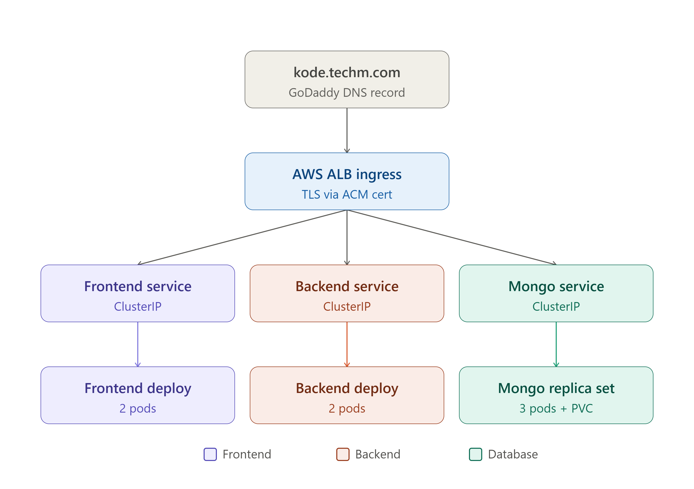

# 🚀 K8s Manifest Deployment — MERN Stack TodoList

[](https://kubernetes.io/)
[](https://helm.sh/)
[](https://argoproj.github.io/cd/)
[](https://aws.amazon.com/eks/)
[](https://www.mongodb.com/)
[](https://opentelemetry.io/)

> **GitOps-driven Helm chart repository** for deploying a production-grade 3-tier MERN stack on AWS EKS.  
> Consumed by ArgoCD — every `git push` triggers an automated, zero-downtime rollout to the cluster.

---

## 📑 Table of Contents

- [Overview](#-overview)
- [Repository Structure](#-repository-structure)
- [Architecture](#-architecture)
- [Charts Deep Dive](#-charts-deep-dive)
- [Autoscaling](#-autoscaling)
- [Networking & Ingress](#-networking--ingress)
- [Security](#-security)
- [GitOps Flow](#-gitops-flow)
- [How to Deploy](#-how-to-deploy)

---

## 🌐 Overview

This repository is the **single source of truth** for the Kubernetes deployment state of the TodoList application. ArgoCD watches this repo — when the CI pipeline updates the `tag:` in `values.yaml`, ArgoCD detects the drift and reconciles the cluster automatically.

| Chart | Responsibility |
|---|---|
| `charts/backend` | Node.js Express API — Deployment, Service, Ingress, HPA, Secret, ConfigMap |
| `charts/frontend` | React/Nginx UI — Deployment, Service, Ingress, HPA, ConfigMap |
| `charts/mongo` | MongoDB 7.0 — StatefulSet, Headless Service, StorageClass (EBS gp3) |
| `charts/observability` | OpenTelemetry Collector, Auto-Instrumentation CR, PodMonitor |

---

## 📁 Repository Structure

```
k8s-manifest-deployment-repo-todolist/
└── charts/
    ├── backend/
    │   ├── templates/
    │   │   ├── be_deployment.yaml      # Deployment with probes + OTel annotation
    │   │   ├── be_service.yaml         # ClusterIP service on port 5000
    │   │   ├── ingress.yaml            # ALB Ingress — path /api, HTTPS
    │   │   ├── secret.yaml             # MONGO_CONN_STR + PORT (Opaque)
    │   │   ├── configmap.yaml          # MONGO_HOST, MONGO_PORT, ENV
    │   │   └── hpa.yaml                # HPA v2 — CPU + Memory scaling
    │   ├── Chart.yaml
    │   ├── values.yaml
    │   └── values-production.yaml
    │
    ├── frontend/
    │   ├── templates/
    │   │   ├── fe_deployment.yaml      # Deployment with topology spread
    │   │   ├── fe_service.yaml         # ClusterIP service on port 80
    │   │   ├── ingress.yaml            # ALB Ingress — path /, HTTPS
    │   │   ├── configmap.yaml          # API_URL, ENV
    │   │   └── hpa.yaml                # HPA v2 — CPU + Memory scaling
    │   ├── Chart.yaml
    │   ├── values.yaml
    │   └── values-production.yaml
    │
    ├── mongo/
    │   ├── templates/
    │   │   ├── db-statefulset.yml      # 3-replica StatefulSet + volumeClaimTemplates
    │   │   ├── db-service.yml          # Headless service for replica set DNS
    │   │   └── storageclass.yaml       # ebs-gp3-sc — encrypted, WaitForFirstConsumer
    │   ├── Chart.yaml
    │   ├── values.yaml
    │   └── values-production.yaml
    │
    └── observability/
        ├── otel-collector.yaml         # OTel Collector — OTLP receiver, Prometheus exporter
        ├── otel-instrument.yaml        # Auto-instrumentation CR for Node.js
        └── otel-collector-monitor.yaml # PodMonitor — scrapes collector metrics
```

---

## 🏗️ Architecture

```



---

## 📦 Charts Deep Dive

### 🔷 Backend

- **Rolling update** with 3-stage health probes — `startupProbe` `/started`, `livenessProbe` `/healthz`, `readinessProbe` `/ready`
- **Topology spread** across AZs (`ScheduleAnyway`) — survives AZ failures
- **OTel auto-instrumentation** — zero-code distributed tracing via annotation:
  ```yaml
  instrumentation.opentelemetry.io/inject-nodejs: "observability/global-instrumentation"
  ```
- `MONGO_CONN_STR` stored as Kubernetes `Opaque` Secret, injected via `envFrom`

| Parameter | Default | Production |
|---|---|---|
| `replicaCount` | 2 | 2 |
| `resources.requests.cpu` | `100m` | `250m` |
| `resources.limits.memory` | `256Mi` | `256Mi` |
| `hpa.maxReplicas` | 5 | 5 |
| `hpa.targetCPUUtilization` | 60% | 60% |

---

### 🔶 Frontend

- `API_URL` read from ConfigMap — decoupled from backend location
- Lighter resource profile (`200m` CPU limit in production)
- Shares the same ALB as backend via `group.name: todolist` — **one load balancer, two services**

| Parameter | Default | Production |
|---|---|---|
| `replicaCount` | 2 | 2 |
| `resources.limits.cpu` | `500m` | `200m` |
| `hpa.maxReplicas` | 5 | 5 |

---

### 🍃 MongoDB

- **3-replica StatefulSet** running `mongod --replSet rs0 --bind_ip_all`
- **Strict topology spread** (`DoNotSchedule`) — pods forced across AZs, survives full AZ outage
- **`volumeClaimTemplates`** — each pod gets its own dedicated EBS volume

Headless service creates stable per-pod DNS:
```
mongo-deployment-0.mongo-headless.production.svc.cluster.local:27017
mongo-deployment-1.mongo-headless.production.svc.cluster.local:27017
mongo-deployment-2.mongo-headless.production.svc.cluster.local:27017
```

StorageClass — `ebs-gp3-sc`:
```yaml
provisioner: ebs.csi.aws.com
volumeBindingMode: WaitForFirstConsumer
parameters:
  type: gp3
  encrypted: "true"
```

---

### 🔭 Observability

- **OTel Collector** — receives OTLP (gRPC + HTTP), exports to Prometheus remote write and Prometheus scrape endpoint `:8889`
- **Instrumentation CR** — auto-injects Node.js SDK into annotated pods, zero app code changes
- **PodMonitor** — registers the collector as a Prometheus scrape target every 15s

---

## 📈 Autoscaling

HPA scales pods horizontally on CPU and memory:

| Scaler | CPU Trigger | Memory Trigger | Min | Max |
|---|---|---|---|---|
| Backend HPA | 60% | 70% | 2 | 5 |
| Frontend HPA | 60% | 70% | 2 | 5 |

---

## 🌐 Networking & Ingress

Both frontend and backend share a **single AWS ALB** via:
```yaml
alb.ingress.kubernetes.io/group.name: todolist
```

| Path | Service | Port |
|---|---|---|
| `/` | `fe-app` | 80 |
| `/api` | `be-app` | 5000 |

TLS terminates at the ALB (ACM cert). HTTP is auto-redirected to HTTPS. All internal traffic (frontend → backend → mongo) stays on ClusterIP — never leaves the VPC.

---

## 🔒 Security

| Layer | Control | Implementation |
|---|---|---|
| Secrets | MongoDB URI never in plaintext | Kubernetes `Opaque` Secret via `envFrom` |
| TLS | End-to-end HTTPS | ACM cert on ALB, HTTP→HTTPS redirect |
| Storage | Encryption at rest | EBS with `encrypted: "true"` in StorageClass |
| Network | Internal traffic in-cluster | ClusterIP only, no NodePort exposure |
| Images | Scanned before deployment | Trivy image scan in CI (HIGH/CRITICAL) |

---

## 🔄 GitOps Flow

```
Developer pushes code
        │
        ▼
CI Pipeline (Jenkins / GitHub Actions)
  1. SonarQube SAST + Quality Gate
  2. OWASP Dependency Check
  3. Trivy filesystem scan
  4. Docker build → push to AWS ECR  (tag: v{BUILD_NUMBER})
  5. Trivy image scan
  6. Update tag in charts/*/values.yaml → git push
        │
        ▼
ArgoCD detects drift → helm upgrade --install
        │
        ▼
Kubernetes Rolling Update
  - New pods start, readiness probe must pass
  - Old pods terminate only after new ones are ready
  - Zero downtime guaranteed
```

---

## 🚀 How to Deploy

### Option 1 — ArgoCD (Recommended)

```bash
kubectl apply -f root-app.yaml -n argocd
```

### Option 2 — Manual Helm

```bash
# MongoDB first
helm upgrade --install mongo ./charts/mongo \
  -f ./charts/mongo/values.yaml \
  -f ./charts/mongo/values-production.yaml \
  -n production --create-namespace

# Backend
helm upgrade --install backend ./charts/backend \
  -f ./charts/backend/values.yaml \
  -f ./charts/backend/values-production.yaml \
  -n production

# Frontend
helm upgrade --install frontend ./charts/frontend \
  -f ./charts/frontend/values.yaml \
  -f ./charts/frontend/values-production.yaml \
  -n production

# Observability
kubectl apply -f ./charts/observability/
```

### Verify

```bash
kubectl get pods -n production
kubectl get hpa -n production
kubectl get ingress -n production
```

---

## 🛠️ Tech Stack

| Category | Technology | Version |
|---|---|---|
| Container Orchestration | AWS EKS | 1.36 |
| Package Manager | Helm | 3 |
| GitOps | ArgoCD | 7.3.11 |
| Frontend | React + Nginx | 17 |
| Backend | Node.js + Express | 20 |
| Database | MongoDB | 7.0 |
| Storage | AWS EBS gp3 (CSI) | — |
| Load Balancer | AWS ALB Ingress Controller | 1.8.1 |
| TLS | AWS ACM | — |
| Metrics | kube-prometheus-stack | 61.3.2 |
| Tracing | OpenTelemetry + Tempo + Jaeger | — |
| Horizontal Scaling | Kubernetes HPA | v2 |

---

*Part of the End-to-End K8s 3-Tier DevSecOps MERN Stack Project —  
covering Terraform infrastructure, Jenkins/GitHub Actions CI, GitOps CD with ArgoCD, and full-stack observability on AWS EKS.*
